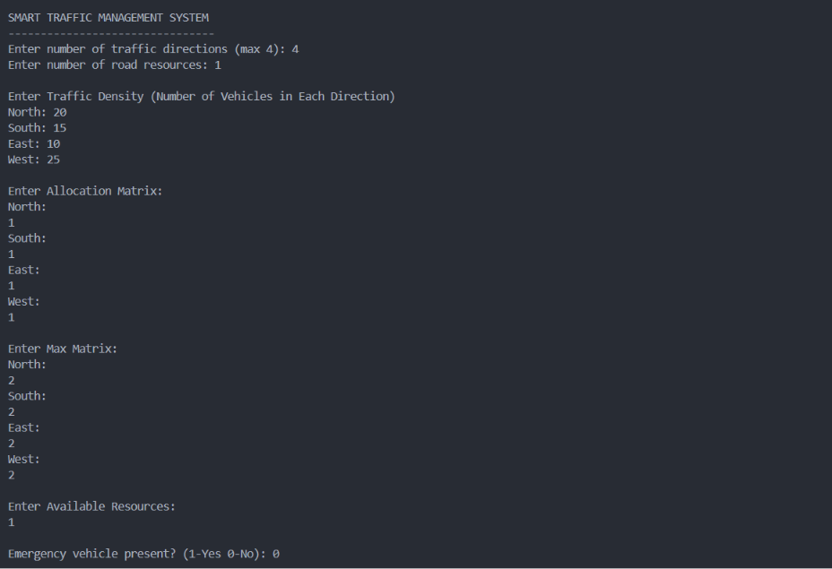
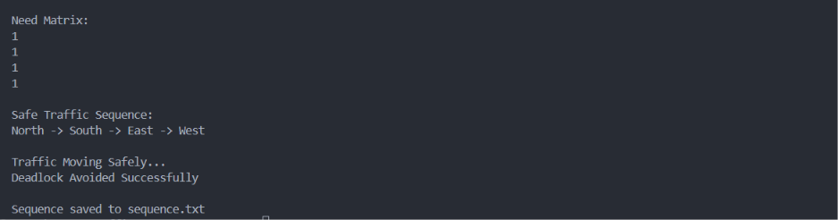
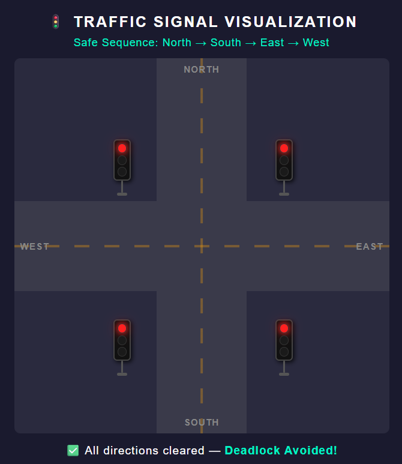

# Smart Traffic Management System using Banker's Algorithm

A Smart Traffic Management System that applies **Banker's Algorithm (Deadlock Avoidance)** to optimize traffic signal scheduling at a four-way intersection. The project calculates a safe sequence for traffic movement, prioritizes emergency vehicles, and visualizes the result through an interactive web interface.

---

## Overview

Traffic congestion at intersections can lead to inefficient traffic flow and deadlock-like situations. This project simulates intelligent traffic management by treating traffic directions as processes and road resources as shared resources.

Using **Banker's Algorithm**, the system determines whether a safe sequence exists for all traffic directions. The generated sequence is then visualized using an animated traffic signal interface.

---

## Features

- Implements Banker's Algorithm for deadlock avoidance
- Calculates the Need Matrix automatically
- Detects safe and unsafe traffic states
- Emergency vehicle priority support
- Generates a Safe Traffic Sequence
- Stores the sequence in `sequence.txt`
- Interactive Traffic Signal Visualization
- Animated traffic movement
- Deadlock detection and status display

---

## Technologies Used

- C Programming
- HTML5
- CSS (Embedded)
- JavaScript (Embedded)
- Visual Studio Code

---

## Project Structure

```
Smart-Traffic-Management/
│
├── traffic.c
├── Traffic.html
├── sequence.txt
├── screenshots/
│   ├── console-input.png
│   ├── console-output.png
│   ├── traffic-visualization.png
│   └── deadlock-avoided.png
└── README.md
```

---

## Working

1. The user enters:
   - Number of traffic directions
   - Number of road resources
   - Traffic density
   - Allocation Matrix
   - Maximum Matrix
   - Available Resources
   - Emergency vehicle status

2. The program calculates the **Need Matrix**.

3. Banker's Algorithm checks whether the system is in a safe state.

4. If a safe sequence exists:
   - The sequence is displayed.
   - The sequence is saved in `sequence.txt`.

5. The HTML visualization reads the generated sequence and animates the traffic signals accordingly.

---

## Screenshots

### Console Input



---

### Console Output



---

### Traffic Signal Visualization


---

### Deadlock Avoided



---

## How to Run

### Step 1: Compile the C Program

```bash
gcc traffic.c -o traffic
```

### Step 2: Execute the Program

Windows

```bash
traffic.exe
```

Linux / macOS

```bash
./traffic
```

The program generates:

```
sequence.txt
```

---

### Step 3: Open the Visualization

Open **Traffic.html** in your browser (or use Live Server in VS Code).

The visualization reads the generated `sequence.txt` file and animates the traffic signals according to the computed safe sequence.

---

## Sample Output

```
Need Matrix

1
1
1
1

Safe Traffic Sequence

North → South → East → West

Traffic Moving Safely...

Deadlock Avoided Successfully

Sequence saved to sequence.txt
```

---

## Applications

- Smart Traffic Signal Control
- Operating Systems Lab Demonstration
- Deadlock Avoidance Simulation
- Resource Allocation Visualization
- Educational Learning Tool

---

## Future Enhancements

- Real-time traffic sensor integration
- AI-based traffic optimization
- Dynamic traffic density prediction
- Multiple intersection support
- IoT-enabled smart traffic management

---

## Learning Outcomes

- Banker's Algorithm
- Deadlock Avoidance
- Resource Allocation
- Operating Systems Concepts
- C Programming
- Traffic Signal Simulation

---

## Author

**Riya Dodiya**

B.Tech – Artificial Intelligence & Machine Learning

Geethanjali College of Engineering and Technology

---

## License

This project is intended for educational and academic purposes.
